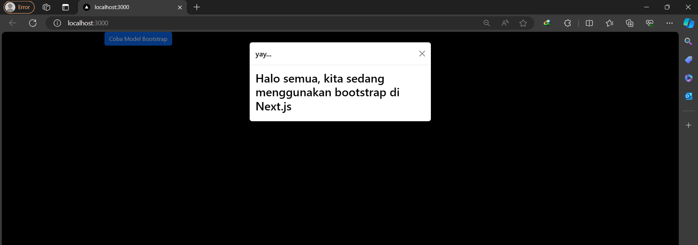
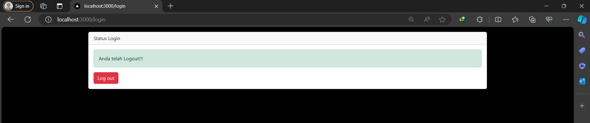
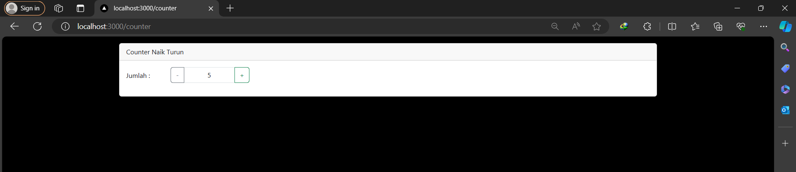
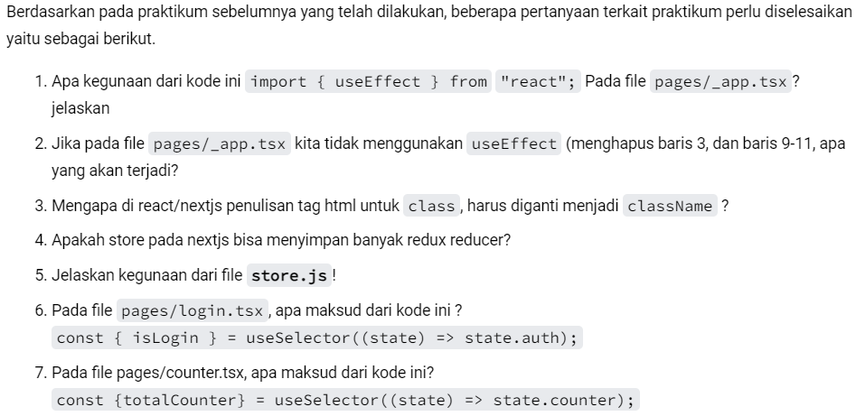

# Laporan Praktikum
- Kynantio Candra Abrari
- 2141720206
- TI 3A

### Praktikum 1

### Praktikum 2

### Praktikum 3

### Soal

1. Coba akses http://localhost:3000/login, dan klik tombol login. Kemudian lakukan refresh page berkali-kali (jika perlu restart npm run dev nya). Simpulkan apa yang terjadi ?

Muncul pesan "Yay, berhasil login!!!" dan ketika logout muncul pesan "Anda telah logout!". Hal ini terjadi karena menggunakan Redux untuk menyimpan data login dan logout sehingga data tersebut tidak akan hilang ketika kita melakukan refresh page maupun melakukan restart npm run dev.

2. Baris 25 dan 30 terdapat method parse(), apa yang terjadi jika kita tidak menggunakan method tersebut?

Jika tidak menggunakan method parse() pada baris 25 dan 30, maka teks HTML yang didefinisikan dalam variabel successAlert dan failedAlert akan ditampilkan sebagai string literal, bukan sebagai HTML yang diinterpretasikan.

### Pertanyaan

1. Digunakan untuk menjalankan kode setelah component pertama kali dirender, menambahkan event listener, melakukan request data dari API, dan membersihkan event listener.
2. Semua operasi yang seharusnya dilakukan setelah render pertama tidak akan dijalankan.
3. Karena menggunakan camelCase untuk penamaan properti JavaScript.
4. Bisa
5. File store.js digunakan untuk menyimpan dan mengelola data pada aplikasi web
6. Digunakan untuk mengambil nilai isLogin dari state Redux.
7. Mengambil nilai totalCounter dari state counter di Redux store dan menyimpannya dalam variabel totalCounter.
